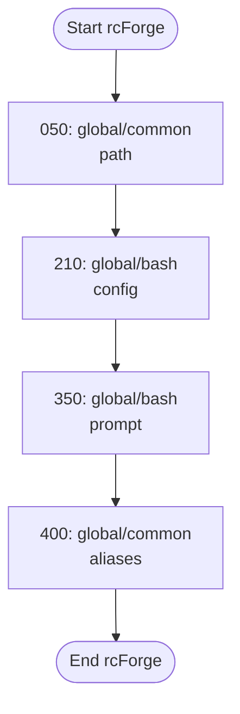

# rcForge Redesign - Version 0.3.0

## Background and Motivation

The rcForge project has evolved through multiple iterations, with each version addressing specific challenges in shell configuration management. The v0.3.0 redesign represents a significant architectural shift aimed at simplifying, securing, and streamlining the shell configuration system.

## Design Philosophy

### Core Principles

1. **User-Centric Design**
   - Prioritize individual user experience
   - Minimize system-level dependencies
   - Provide maximum flexibility
2. **Simplicity**
   - Every component must justify its existence
   - Minimize complexity
   - Optimize for readability and maintainability
3. **Security**
   - Implement security by design
   - Minimal privilege principle
   - Prevent potential vulnerabilities
4. **Modularity**
   - Easy to extend
   - Clear separation of concerns
   - Support diverse use cases
5. **Space conservation**
   * Documentation will be primarily online (cuts storage by 75%)
6. **Shell Compatibility**
   * Core system requires Bash 4.0+ for implementation
   * End user experience treats Bash and Zsh as equal first-class citizens
   * RC scripts can be shell-specific or shared across shells
   * All system scripts use `#!/usr/bin/env bash` for cross-platform compatibility

## Target Audience

rcForge is designed primarily for individual users who want a clean, structured way to manage their shell configurations. This focus on individual users allows for:

- Simplified installation process (no root permissions needed)
- User-centered customization options
- Straightforward configuration management
- Personal workflow optimization

While the current focus is on individual users, the architecture is flexible enough to potentially support team or organizational use in the future if demand arises.

## Design Rationale

The key design decisions in v0.3.0 address specific pain points from previous versions:

1. **User-Level Installation**: Eliminates root permission requirements, making installation and management simpler and more secure.

2. **Flattened Script Directory**: Improves visibility and organization of configuration scripts.

3. **Lazy-Loaded RC Command**: Minimizes impact on shell startup time while maintaining full functionality.

4. **Simplified Include System**: Reduces complexity while preserving essential functionality.

5. **Clear Separation of User and System Components**: Allows for easier customization without breaking core functionality.

6. **Multi-Shell Support**: Provides first-class support for both Bash and Zsh while keeping core implementation in Bash 4.0+.

These decisions aim to create a shell configuration system that is powerful yet intuitive, maintaining flexibility while reducing complexity.

## Architectural Changes

### Directory Structure

```
${HOME}/.config/rcforge/
├── backups                           # rcForge tarballs (utility & upgrade)
├── docs                              # User documentation
├── rc-scripts                        # User shell configuration scripts
│   ├── 050_global_common_path.sh     # Example sequenced rc-scripts
│   ├── 210_global_bash_config.sh     #    ↓
│   ├── 210_global_zsh_config.sh      #    ↓
│   ├── 310_global_zsh_plugins.sh     #    ↓
│   ├── 350_global_bash_prompt.sh     #    ↓
│   ├── 350_global_zsh_prompt.sh      #    ↓
│   ├── 400_global_common_aliases.sh  #    ↓
├── rcforge.sh                        # Core script for rcforge.sh
├── system                            # Managed system files
│   ├── core                          # Core system-only scripts
│   ├── include                       # System include files
│   ├── lib                           # System libraries
│   └── utils                         # System utility scripts
│       ├── seq.sh                    # Example system utils
│       ├── diag.sh                   #    ↓
│       ├── export.sh                 #    ↓
│       └── dnslookup.sh              #    ↓
└── utils                             # User utility scripts
```

### User Override Precedence

A fundamental principle in rcForge v0.3.0 is that user-defined configurations and utilities always take precedence over system ones. This means:

- If a user creates a utility with the same name as a system utility, the user's version will be used
- User rc-scripts can override or extend system functionality without breaking the core system
- Custom configurations are fully preserved during updates

This approach empowers users to customize their environment without fear of breaking core functionality, while still benefiting from system updates.

Example of user override:
```bash
# A user who wants to customize the built-in 'httpheaders' utility
# Simply creates their own version in the user utils directory
$ cp ~/.config/rcforge/system/utils/httpheaders.sh ~/.config/rcforge/utils/httpheaders.sh
$ vim ~/.config/rcforge/utils/httpheaders.sh
# The user's version will now be used instead of the system version
```

### Key Design Decisions

#### 1. Shell Compatibility
- Core system implemented in Bash 4.0+ for reliable functionality
- Support for both Bash and Zsh as first-class shells for end users
- Shell-specific scripts with parallel naming conventions
- Common scripts for shell-agnostic functionality

#### 2. Lazy-Loaded RC Function
- Implement a minimal stub for the `rc` command
- Full implementation loaded only when first invoked
- Reduces memory footprint
- Improves startup performance

#### 3. Utility Script Flexibility
- Support utilities in any language
- Not limited to shell scripts
- Executable from a central `rc` command interface

#### 4. Configuration Loading
- Maintain sequence-based loading
- Shell-specific script directories
- Support hostname-based configurations
- Preserve existing naming conventions

Example loading sequence:
```
050_global_common_path.sh      # Loaded first (path configuration)
210_global_bash_config.sh      # Bash-specific configuration
350_global_bash_prompt.sh      # Bash prompt setup
400_global_common_aliases.sh   # Common aliases for all shells
```

#### 5. Include System

The include system has been simplified in v0.3.0, adopting a pragmatic approach to functions versus scripts:

- Minimal core function sourcing
- Source-able utility files for common needs (e.g., colors, messaging)
- Focus on the right tool for the job rather than strict rules

**When to use functions:**
- For operations frequently needed across multiple scripts
- For consistent UI elements (colors, messaging, prompts)
- When maintaining state between operations

**When to use standalone scripts:**
- For complete, self-contained operations
- For less frequently used utilities
- When language other than Bash is preferred

Source-able files like `shell-colors.sh` remain important for maintaining consistent styling and behavior across both system and user scripts.

#### 6. RC Help System and Command Functionality

##### Core Command Structure

- `rc` is a lazy-loaded function that only loads its full implementation when first called

- Supports a flexible, discoverable interface for system and user utilities

- While the utility scripts written to support rc will have the .sh extension, execution from within rc will not require or list the .sh extension. For example, `htttheaders.sh` would be executed as `rc httpheaders example.com` and would be listed as 

  ​	`httpheaders   Retrieves and displays HTTP headers for the specified URL` 

##### Command Types

1. **General Help**

   ```bash
   rc help
   ```

   - Displays a brief overview paragraph

   - Lists all available commands (both system and user)

   - Format:

     ```
     [Command Name]   [One-line description from rc cmd summary]
     ```

2. **Command Summary**

   ```bash
   rc cmd summary
   ```

   - Prints a concise, one-line description of a specific command

3. **Command-Specific Help**

   ```bash
   rc cmd help
   ```

   - Displays detailed help documentation for a specific command
   - Uses `.help` files in the command's directory
   - Typically includes:
     - Full command description
     - Usage instructions
     - Available options
     - Examples

4. **Search Functionality**

   ```bash
   rc search [search_term]
   ```

   - Lists commands that match the search term
   - Searches in:
     - Command names
     - Command descriptions
   - Helps users rediscover existing utilities

##### Key Design Principles

- Lazy loading of full implementation
- Consistent documentation format, including support libraries to make this easy to implement
- Easy discoverability of utilities
- Support for both system and user-defined commands
- Simple search capabilities

##### Example RC Command Interaction

```bash
$ rc help
rcForge Utility Command (v0.3.0)

Available commands:
httpheaders   Retrieves and displays HTTP headers for the specified URL
isup          Checks if a website is up and responding
diagram       Generates visual representation of rc-scripts loading order
colors        Displays available terminal colors and formatting
findport      Finds which process is using a specific port

Use 'rc <command> help' for detailed information about a command.
Use 'rc search <term>' to find commands related to a topic.

$ rc search http
Commands related to 'http':
httpheaders   Retrieves and displays HTTP headers for the specified URL
isup          Checks if a website is up and responding

$ rc httpheaders help
httpheaders - HTTP Headers Utility

Description:
  Retrieves and displays HTTP headers from a URL with formatting options.

Usage:
  rc httpheaders [options] <url>

Options:
  -v, --verbose    Show detailed request/response information
  -j, --json       Output in JSON format
  -f, --follow     Follow redirects

Examples:
  rc httpheaders example.com
  rc httpheaders -v https://github.com
  rc httpheaders -j -f https://redirecting-site.com
```

## Conflict Detection and Visualization

rcForge v0.3.0 preserves and enhances the conflict detection tools from previous versions:

1. **Diagram Utility**: Generates visual representations of the rc-scripts loading sequence, making it easy to understand the execution order and potential conflicts.

2. **Sequence Conflict Detection**: Automatically identifies and reports duplicate sequence numbers or other potential conflicts in the loading order.

3. **Interactive Resolution**: Provides guidance and options for resolving detected conflicts.

These tools help users understand and maintain their configurations, especially as they add more customizations over time.

Example diagram output:
```
# Configuration Loading Order Diagram


## Installation and Upgrade Processes

### Core Principles

- User-level installation
- No system-wide or root-level requirements
- Supports both fresh install and upgrade scenarios

### Directory Structure Creation

```bash
~/.config/rcforge/
├── utils            # User utility scripts
├── rc-scripts/      # User shell configuration scripts
├── backups          # Upgrade tarballs
└── system           # Managed system files
    ├── lib          # System libraries
    ├── include      # System include files
    └── utils        # System utility scripts
```

### Installation Script Key Features

1. **Bash Version Check**
   - Verifies Bash 4.0+ is available
   - Provides guidance for macOS users to install modern Bash
   - Ensures proper environment for core functionality
2. **Backup Mechanism**
   - Creates a timestamped backup before installation
   - Stores backup in `~/.config/rcforge/backups/`
   - Allows easy rollback if needed
3. **Flexible Installation**
   - Detects if it's a first-time install or an upgrade
   - Sets appropriate flags (`gc_upgrade`)
   - Provides different messaging for new vs. existing users
4. **Directory Setup**
   - Creates necessary directory structure
   - Sets appropriate file permissions
   - Separates system and user-specific components

### Upgrade Process

1. **Detection**

   ```bash
   if [ -e .config/rcforge ]; then
     readonly gc_upgrade=true
     # backup logic
   else
     readonly gc_upgrade=false
   fi
   ```

2. **Backup Steps**

   - Tarball entire existing rcForge directory
   - Store in version-specific backup location
   - Preserve user configurations and scripts

3. **Installation/Upgrade Flow**

   ```bash
   # post-install messaging
   
   if $gc_upgrade; then
     display upgrade message
     display any specific upgrade steps
   else
     display new user welcome
     display initial setup instructions
     recommend version control
   fi
   ```

### Post-Installation Recommendations

1. **Version Control**
   - Explicitly recommend storing configuration in:
     - Private GitHub repository
     - Cloud storage with versioning
   - Provide clear instructions
   - Highlight importance of backing up configurations
2. **Shell Integration**
   - Automatically update shell RC files
   - Add source line for rcForge
   - Support for bash and zsh

### User Experience Goals

- Minimal friction during installation
- Easy to understand and use
- Provides clear guidance
- Supports various user scenarios
- Encourages best practices (version control, backup)

## Getting Started

### Quick Start

1. **Installation**
   ```bash
   curl -fsSL https://raw.githubusercontent.com/rcforge/install/main/install.sh | bash
   ```

2. **Initial Setup**
   ```bash
   # Source rcForge in your current shell
   source ~/.config/rcforge/rcforge.sh
   
   # Run the help command to see available utilities
   rc help
   ```

3. **Basic Customization**
   ```bash
   # Create a custom alias configuration
   vim ~/.config/rcforge/rc-scripts/410_global_common_myaliases.sh
   
   # Example content for the file:
   #!/bin/bash
   # My custom aliases
   alias ll='ls -la'
   alias projects='cd ~/Projects'
   ```

### Common Use Cases

1. **Managing Different Shell Environments**
   - Create shell-specific configurations in bash/zsh directories
   - Use `global_common` for shared settings

2. **Machine-Specific Configurations**
   - Create hostname-specific settings using `hostname_shell` naming

3. **Creating Custom Utilities**
   - Add scripts to the `utils` directory
   - Make them executable (`chmod +x`)
   - Access via the `rc` command

## Version Roadmap

```
0.3.0 - Core Rewrite Foundation
- Clean architecture design
- Minimal viable loader
- Basic include mechanism
- User-level installation
- Multi-shell support (Bash & Zsh)

0.4.0 - Functional Expansion
- Port core utility functions
- Enhanced include system
- Basic rc command framework
- Testing primarily zsh/macOS

0.4.1 - Reduce namespace clutter
- Only user-facing and critical functions
- Only user-facing and critical variables
- Additional testing on macOS (zsh) and Linux (bash)

0.5.0 - Security Audit & Hardening
- Comprehensive security review
- Penetration testing
- Vulnerability assessment
- Security best practices implementation

0.6.0 - Compatibility & Testing
- Cross-platform testing
- Performance optimization
- Migration tools

0.7.0 - Release Candidate
- Comprehensive documentation
	- Document all exported variables and functions
- Installer improvements
- Default configuration templates

0.8.0 - Reserved for refactoring and major design issues

0.9.0 - Pre-Release
- Final bug fixes
- Performance tuning
- Community feedback incorporation

1.0.0 - Stable Release
```

## Security Considerations

### Root Execution Prevention
- Explicit checks to prevent system-wide installation
- Warnings and blocks for root-level execution
- User-level focus

### File Permissions

- Strict permission defaults
- 700 for directories
- 700 for scripts
- 600 for configuration and documentation files

## Migration Considerations

**THERE ARE NO EXISTING USERS**

## Open Questions and Future Exploration

1. Long-term evolution of the include system
2. Potential enhancements to the `rc` command framework
3. Community-driven utility script ecosystem
4. Additional shell support beyond Bash and Zsh

## Conclusion

The v0.3.0 redesign represents a strategic pivot towards a more focused, user-friendly shell configuration management system. By prioritizing simplicity, security, and flexibility, rcForge aims to provide a powerful yet intuitive solution for developers and system administrators. With strong multi-shell support and a clear separation between system and user components, rcForge creates a solid foundation for customized shell environments across different platforms.

# EOF
