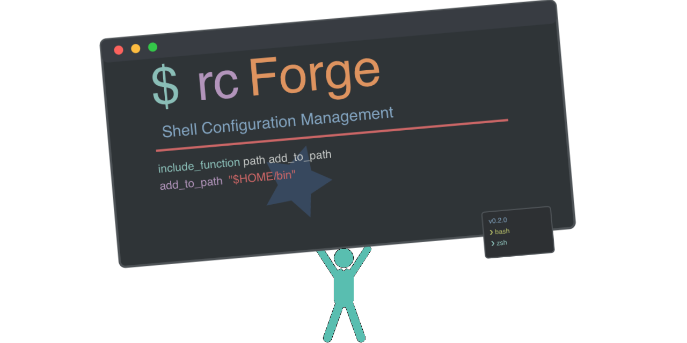

# rcForge: Shell Configuration Management

Tired of chaotic shell configuration files that have grown over years? Ever log into a new machine and feel lost without your personalized aliases, functions, and prompt? rcForge is a modular, maintainable open-source system designed to bring order and consistency to your Bash and Zsh environments across all your machines. Born from a 15+ year personal journey and refined with AI collaboration, rcForge helps you transform shell config chaos into a robust, organized, and portable setup. (Note: rcForge's core utilities require Bash version 4.3 or higher.)

## Why Choose rcForge? Taming the Terminal Chaos

If you've ever felt the frustration of inconsistent shell environments across machines, or if your `.bashrc` or `.zshrc` has grown into a monolithic beast that's hard to manage, rcForge offers a structured, maintainable solution. Here’s what rcForge brings to the table:

* **Consistency Across Machines:** Say goodbye to recreating your aliases and functions every time you log into a new server or get a new laptop. Define them once, use them everywhere rcForge is installed.
* **Sensible Organization:** Instead of one giant file, rcForge encourages breaking your configuration into logical, sequence-numbered modules (`###_host_env_desc.sh`). Finding and modifying specific settings becomes trivial.
* **Reliable Loading:** The sequence-based system ensures your configurations load predictably every time, eliminating weird bugs caused by incorrect loading order.
* **Cross-Shell Harmony:** Manage configurations for both Bash and Zsh from a single framework, sharing common elements while keeping shell-specific tweaks separate. No more maintaining parallel, slightly different rc files!
* **Useful Built-in Tools:** The `rc` command isn't just for running your own scripts; it provides utilities like `diag` to visualize loading order, `chkseq` to find conflicts, and `export` to package your setup for systems where you can't install rcForge directly.
* **User Control:** It runs entirely in your user space, requires no root privileges, and you can easily override any system utility with your own version.

Ultimately, rcForge is designed to bring order to the potential chaos of shell customization. It transforms your configuration from a personal, sometimes fragile, setup into a robust, organized, and portable system – saving you time and frustration in the long run.

## Getting Started

**Prerequisite:** rcForge's core utilities require Bash v4.3+. macOS users typically need to install a newer version using [Homebrew](https://brew.sh/): `brew install bash`. Ensure this version is available in your PATH before proceeding.

Installing rcForge is straightforward:

```bash
# Installs or upgrades rcForge to ~/.config/rcforge
curl -fsSL [https://raw.githubusercontent.com/mhasse1/rcforge/main/install-script.sh](https://raw.githubusercontent.com/mhasse1/rcforge/main/install-script.sh) | bash
```

**Important:** The installer adds a *commented-out* source line to your `~/.bashrc` and `~/.zshrc`. After testing rcForge manually in your current shell (`source ~/.config/rcforge/rcforge.sh`), you must **uncomment** that line in your RC file(s) for rcForge to load automatically in new shells.

Once installed and sourced, you can start using the `rc` command:

```
# Display available commands and their summaries
rc list

# Example: Check HTTP headers for a website
rc httpheaders example.com

# Example: Export your Bash configuration for a remote system
rc export --shell=bash
```

## How rcForge Works: Modularity in Action

rcForge uses a simple but powerful system based on sequentially numbered scripts stored in `~/.config/rcforge/rc-scripts/`. These files follow a naming convention (`###_host_env_desc.sh`) that allows rcForge to automatically load the correct configurations for your current hostname (or global defaults) and shell (Bash or Zsh).

This modular approach breaks down complex configurations into manageable pieces. To see this in action, here's an example execution path for a Bash configuration on a machine named 'laptop':


### Key features include:

* **Modular Configuration:** As shown above, break your setup into logical chunks.
* **Cross-Shell Compatibility:** Supports Bash and Zsh, sharing common configs.
* **The "rc" Command Framework:** A unified interface (`rc help`, `rc diag`, `rc export`, etc.) to manage your setup and run utilities. Easily add your own commands!
* **Conflict Detection & Visualization:** Tools (`rc chkseq`, `rc diag`) identify issues and show loading order.
* **Export Capability:** Package your configuration into a single file for remote systems (`rc export`).

## Find Out More

Ready to dive deeper or contribute?

* **Documentation:** [rcForge Wiki](https://github.com/mhasse1/rcforge/wiki) - Documentation is kept on the GitHub wiki.. 
* **GitHub Repository:** [rcForge on GitHub](https://github.com/mhasse1/rcforge) - Source code, report issues, or suggest features.
* **Read the Story:*** [From Chaos to Control](https://www.linkedin.com/pulse/from-chaos-control-how-i-transformed-my-shell-config-open-mark-hasse-6wqcc): Read the story behind rcForge 

---
*rcForge - Taming the Terminal Chaos*
